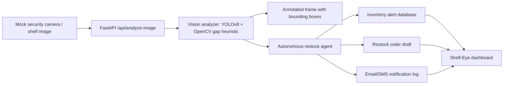

# Shelf-Eye

Autonomous Vision-AI store agent that analyzes shelf camera frames, flags empty shelf zones, creates inventory alerts, drafts restock orders, and logs email/SMS-style notifications for subscribed store operators.

This is built as a corporate-grade portfolio demo for retail operations automation: FastAPI backend, OpenCV/YOLO image analysis, autonomous agent workflow, dashboard UI, Docker packaging, and a clean API surface.

## Why It Matters

Retail out-of-stocks directly create revenue leakage and poor customer experience. Shelf-Eye shows how store camera feeds can become a real-time operating layer:

- Detect shelf availability risk from image frames.
- Convert empty shelf detections into structured alerts.
- Trigger a restock agent that drafts distribution center orders.
- Notify subscribed store managers through email/SMS-ready notification records.
- Give leaders a live dashboard for open alerts, restock drafts, and anomaly history.

## System Architecture



## Features

- FastAPI service with clean REST endpoints.
- Dashboard at `/` for uploading shelf images and monitoring results.
- YOLOv8 object detection when `yolov8n.pt` is present.
- Deterministic OpenCV empty shelf gap detection so demos still work offline.
- Agent workflow that automatically creates alert, restock order, and notification records.
- Alert subscriber capture for email or phone recipients.
- JSON-backed local persistence for demo portability.
- Dockerfile and `.dockerignore` for deployment.
- Unit test for the core agent workflow.

## API

| Method | Endpoint | Purpose |
| --- | --- | --- |
| `GET` | `/health` | Service health check |
| `GET` | `/api/overview` | Dashboard KPIs and recent records |
| `POST` | `/api/analyze-image` | Analyze shelf image and trigger agent workflow |
| `GET` | `/api/alerts` | List inventory alerts |
| `PATCH` | `/api/alerts/{alert_id}` | Update alert status |
| `GET` | `/api/restock-orders` | List restock order drafts |
| `POST` | `/api/subscribers` | Add an email/phone alert recipient |
| `GET` | `/api/notifications` | List simulated outbound notifications |

## Local Run

```bash
python -m venv venv
venv\Scripts\activate
pip install -r requirements.txt
uvicorn backend.main:app --reload
```

Open:

- Dashboard: <http://127.0.0.1:8000>
- Swagger API docs: <http://127.0.0.1:8000/docs>

## Docker

```bash
docker build -t shelf-eye .
docker run --rm -p 8000:8000 shelf-eye
```

## How "Shelf-Eye" Scales To Reduce Walmart Store Revenue Leakages By Automating Stock Monitoring

Shelf-Eye turns passive camera infrastructure into an active replenishment signal. At Walmart scale, the same workflow can run per store, per aisle, and per product category:

- Edge cameras or store NVRs stream frames into a lightweight inference service.
- FastAPI accepts frame batches asynchronously and stores only alerts plus annotated evidence.
- Detection thresholds can be tuned per category, planogram, or time of day.
- Restock orders can integrate with inventory systems, handheld associate apps, or distribution center queues.
- Notification routing can escalate from associate to department manager to store lead based on SLA.
- Aggregated alert history reveals chronic out-of-stock zones and layout optimization opportunities.
